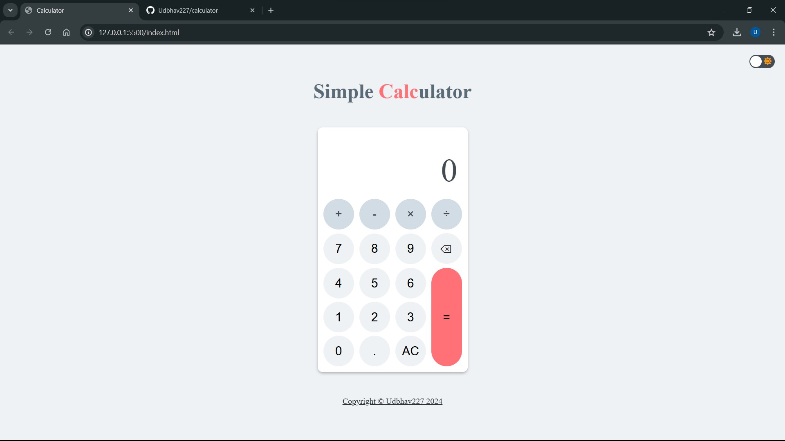
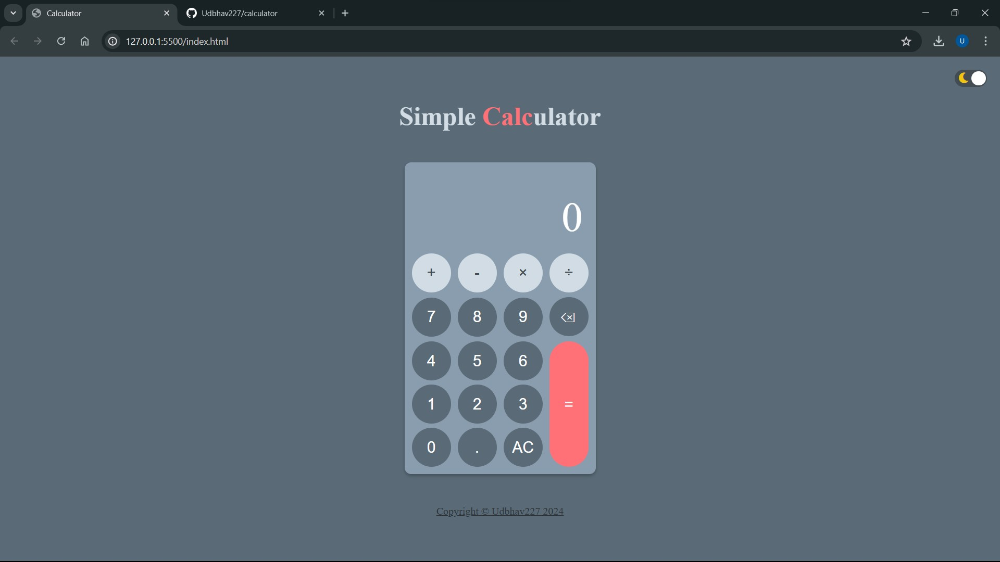

# 🧮 Calculator

Welcome to the Calculator project! This project was created to practice and demonstrate the use of HTML, CSS, and JavaScript.

## 🌐 Website 

You can view the live website here: [udbhav227.github.io/calculator](https://udbhav227.github.io/calculator)

## 📚 Project Description

This is a simple web-based calculator application. The project is designed to showcase the following:

- Use of HTML for structuring the content.
- Use of CSS for styling and layout.
- Use of JavaScript for dynamic behavior and interactivity.

## 📝 Features 

- **Basic Arithmetic Operations**: Supports addition, subtraction, multiplication, and division.
- **Dark Mode**: Toggle between dark mode and light mode.
- **Clear Button**: Resets the calculator display.
- **Keyboard Support**: Performs operation using keyboard.

## 📸 Screenshots 

## 🛠️ Technologies Used

- HTML5
- CSS3
- JavaScript (DOM manipulation and event listeners)

## ⚙️ Skills Practiced

- **HTML**: Creating a structured layout for the application.
- **CSS**: Styling the calculator to make it visually appealing using flexbox.
- **JavaScript**: Adding interactivity to the application through DOM manipulation and event listeners.
